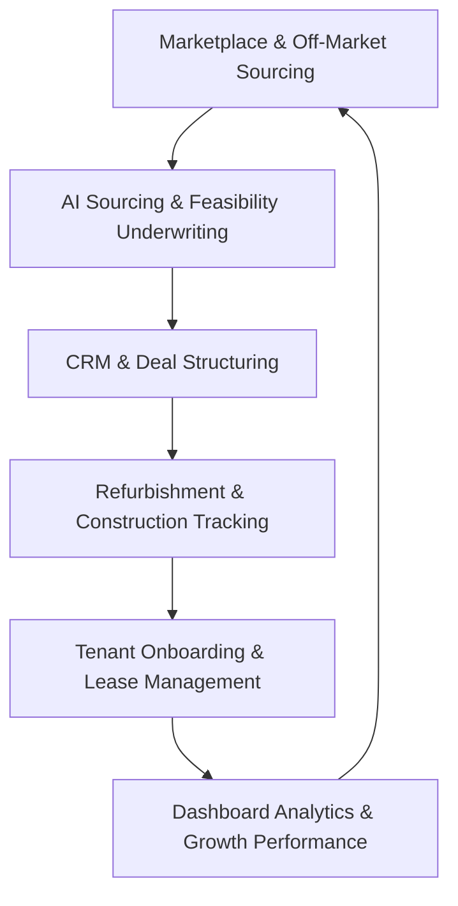

# PropIntel AI (Housing Hub) — Product Documentation

Welcome to the official product documentation for **PropIntel AI** (formerly Housing Hub), the premier, enterprise-grade, AI-Powered Real Estate Sourcing, Underwriting, and Portfolio Management Single Page Application (SPA). 

This document serves as both a product brochure and a functional user guide, written in simple, non-technical English. It is designed for business stakeholders, prospective clients, sales teams, and developers to understand the capabilities, design philosophy, and business value of the platform.

---

## Table of Contents
1. [Executive Summary](#1-executive-summary)
2. [Platform Overview](#2-platform-overview)
3. [Detailed Module Documentation](#3-detailed-module-documentation)
   - [Dashboard (Executive Command Center)](#dashboard-executive-command-center)
   - [Smart Marketplace](#smart-marketplace)
   - [Property Portfolio](#property-portfolio)
   - [CRM & Sales Automation](#crm--sales-automation)
   - [Market Intelligence (Analytics)](#market-intelligence-analytics)
   - [AI Price & Yield Predictor](#ai-price--yield-predictor)
   - [Construction & Refurb Management](#construction--refurb-management)
   - [Tenant & Lease Operations](#tenant--lease-operations)
   - [Investment Feasibility Simulator](#investment-feasibility-simulator)
   - [Confidential Off-Market Portal](#confidential-off-market-portal)
   - [Secure Document Vault](#secure-document-vault)
   - [System Administration Console](#system-administration-console)
   - [Enterprise Settings](#enterprise-settings)
4. [User Roles and Permissions](#4-user-roles-and-permissions)
5. [Typical User Workflows](#5-typical-user-workflows)
6. [Key Business Benefits](#6-key-business-benefits)
7. [Conclusion](#7-conclusion)

---

## 1. Executive Summary

### What the Platform Is
**PropIntel AI** is a unified, high-performance real estate intelligence platform. It brings together sourcing, underwriting, transaction workflow management, refurbishment tracking, tenant relations, and predictive AI modeling into a single, cohesive client-side dashboard. Designed with a modern, glassmorphic design language ("Aetheria"), the platform turns complex property datasets into clear, actionable visual insights.

### The Business Problems It Solves
* **Information Fragmentation**: Real estate companies usually waste hours copying data between CRM spreadsheets, construction trackers, underwriting calculators, and legal folders. PropIntel AI integrates these into one workspace.
* **Underwriting Guesswork**: Calculating property appreciation, refurbishment ROI, and cash-on-cash returns has traditionally relied on slow, manual calculations. The platform's integrated AI engines automate this process.
* **Access to Private Inventory**: The industry's best opportunities are often traded privately. PropIntel AI provides a secure portal for off-market, confidential listings protected by Non-Disclosure Agreements (NDAs).
* **Operational Disconnects**: Sourcing managers, contractors, legal partners, and property managers often work in silos. This platform provides distinct dashboards tailored to each role, keeping everyone aligned.

### Key Benefits
* **Faster Deals**: Instantly identify undervalued opportunities, simulate yield projections, and submit inquiries in seconds.
* **Higher Yields**: Leverage predictive analytics to focus capital on high-performing geographical areas and property types.
* **Reduced Refurbishment Risk**: Track construction budgets, contractors, and timelines in real time to avoid cost overruns.
* **Institutional Security**: Control data access with role-based routing and secure digital NDA signatures.

---

## 2. Platform Overview

### Purpose of the Platform
The core purpose of PropIntel AI is to maximize the acquisition speed and operational yield of real estate portfolios. By combining real-time market data with automated analysis, the platform lets acquisitions teams move from property sourcing to legal signing within days rather than months.

### Target Users
* **Institutional Real Estate Funds**: Looking to build and manage large residential portfolios.
* **Sourcing Agencies**: Seeking to source, package, and resell investment portfolios to institutional buyers.
* **Housing Associations & Local Councils**: Coordinating regional property allocations and managing active tenancies.
* **Construction & Renovation Companies**: Managing contractors and budgets for property refurbishments.

### Main Capabilities
* **AI-Powered Underwriting**: Instantly run Monte Carlo simulations and appreciation forecasting models.
* **Interactive Marketplace**: Evaluate public and private listings using side-by-side comparison matrices.
* **Unified CRM & Pipeline**: Track investor outreach, schedule viewings, and log communications.
* **Active Property Management**: Oversee physical assets, track maintenance requests, and audit lease agreements.

### How Different Modules Work Together
The modules in PropIntel AI form a continuous circle of real estate operations:

Sourced properties are qualified through the **Underwriter**, moved through the **CRM Sales Pipeline**, converted to physical projects in the **Refurbishment Tracker**, assigned leases in **Tenants**, and aggregated for analysis in the **Executive Command Center**.

---

## 3. Detailed Module Documentation

### Dashboard (Executive Command Center)
The entry point of the platform. It provides a real-time, cross-module view of portfolio health, active projects, and automated recommendations.

* **Purpose**: Gives managers a central location to monitor performance and make decisions.
* **KPI Cards**:
  * *Gross Portfolio Value*: Combined value of all acquired assets, including year-over-year growth metrics.
  * *Active Acquisitions*: The number of properties currently in the legal or sourcing pipeline.
  * *Average Net Yield*: The net percentage return of the active portfolio compared to current market averages.
  * *Construction & Refurbs*: The number of active renovation projects.
* **Charts**: 
  * *Sourcing & Spend Projection*: An area chart showing completed acquisitions against the ongoing pipeline over a 12-month trend.
  * *Portfolio Composition*: A color-coded pie chart breaking down the portfolio value by asset class (e.g., Commercial, Single Family, Student Housing).
* **Recent Activities**: A real-time log displaying the latest updates from contractors, legal partners, and system alerts.
* **AI Insights Alert**: A prominent recommendation card pointing out undervalued regional markets and yield projections.
* **Business Value**: Saves leadership teams from reviewing multiple reports by displaying key portfolio metrics in a single view.

---

### Smart Marketplace
A hub where users can browse, filter, compare, and inquire about public properties.

* **Purpose**: Simplifies property search and initial vetting.
* **Property Listings**: Interactive grid cards featuring high-resolution images, yield metrics, structural data (bedrooms, bathrooms), and energy efficiency grades (EPC).
* **Search and Filters**: A real-time search bar that filters listings by address, city, postcode, property type, and availability status.
* **Property Comparison**: A floating tray that lets users select up to three properties and compare their financial and structural metrics side-by-side in a matrix table.
* **Favorites**: A bookmarking tool that saves specific listings for tracking or yield comparison.
* **Buyer Dashboard**: Allows investors to view saved properties, scheduled viewings, and mortgage pre-approval status.
* **Seller Dashboard**: Allows agents or developers to list properties, manage active listings, and edit guide prices.
* **Agent Dashboard & Lead Management**: An inbox for listing agents to review incoming offers and viewing requests.
* **Business Value**: Increases transaction volume by helping buyers find, compare, and inquire about properties quickly.

---

### Property Portfolio
The internal system of record for all properties currently owned or under review.

* **Purpose**: Tracks property-specific details, files, and histories.
* **Property Management**: A database of assets classified by status (e.g., *Available*, *Under Review*, *Acquired*, *Refurbishing*, *Tenanted*).
* **Property Details**: Granular asset profiles showing room numbers, regional council allocations, and exact guide prices.
* **Documents Vault**: An integrated uploader where users can attach surveys, floorplans, and energy efficiency certificates directly to the property record.
* **Internal Discussion Wall**: A comment board where acquisition specialists and underwriters can share notes, comparable sales, and flags.
* **Timeline**: A visual history of the property (e.g., when it was sourced, when surveys were uploaded, and when the valuation was completed).
* **Business Value**: Centralizes property information, eliminating lost files and communication gaps during the diligence process.

---

### CRM & Sales Automation
A pipeline management tool that helps convert sourced properties into closed deals.

* **Purpose**: Tracks investor relations, outreach, and communications.
* **Sales Pipeline**: A visual board that categorizes deals by progress stage (*New*, *Qualified*, *Proposal*, *Under Contract*, *Closed Won*). Users can update deal stages using dropdown menus.
* **Leads Directory**: A list of prospective buyers with contact information and probability meters showing their likelihood to purchase.
* **Lead Scoring**: An AI-generated indicator (from 0 to 100) that evaluates the buyer's activity level and purchase intent.
* **Outreach Campaigns**: Logs marketing campaigns across channels (Email, SMS) showing open rates, click-through rates (CTR), and response rates.
* **Appointments & Events Scheduler**: A built-in scheduler to coordinate viewings, investment consultations, and negotiations.
* **Business Value**: Helps sales teams close deals faster by highlighting high-priority leads and keeping communication histories in one place.

---

### Market Intelligence (Analytics)
A module focused on regional research, pricing trends, and competitive benchmarking.

* **Purpose**: Helps users identify where to buy properties for the best returns.
* **Sourcing Heatmaps**: Interactive card grids highlighting high-yield regional cities (e.g., Leeds, Manchester) with compound annual growth rates (CAGR) and demand scores.
* **Supply & Demand**: Area charts visualizing the gap between regional rental demand and listed inventory supply.
* **Competitor Benchmarking**: A radar chart comparing the user's sourcing speed, LTV (Loan-to-Value) leverage, cost of debt, and energy efficiency upgrades against traditional retail buyers.
* **Business Value**: Minimizes investment risk by using market data to guide geographic expansion.

---

### AI Price & Yield Predictor
A simulator tool that forecasts property performance using input parameters.

* **Purpose**: Automates property underwriting and financial projection tasks.
* **Neural Network Simulator**: An input panel where users can specify a postcode, property type, bedrooms, current energy rating (EPC), and refurbishment scope (light, medium, heavy).
* **Financial Appraisals**: Instantly calculates estimated valuation, suggested offer price, net rental yield, monthly rent, Internal Rate of Return (IRR), and Net Present Value (NPV).
* **5-Year Growth Projections**: Interactive charts showing forecasted asset value appreciation alongside compound monthly rental growth.
* **Comparative Market Analysis (CMA)**: A table listing recent comparable home sales and yields in the immediate area.
* **AI Strategic Assessment**: AI-generated suggestions (e.g., recommending a room conversion to boost yield).
* **Business Value**: Reduces manual underwriting time from hours to seconds, allowing teams to evaluate more properties in less time.

---

### Construction & Refurb Management
A tracker for properties undergoing renovation before being leased or sold.

* **Purpose**: Monitors contractor progress, milestones, and project spending.
* **Project Tracking**: Cards showing active renovation progress bars, contractor assignments, and start/end dates.
* **Budget Tracker**: Visual meters comparing the actual spent amount against the allocated refurbishment budget.
* **Milestones**: Status updates detailing phase progress (e.g., *Phase 1: Sourcing*, *Phase 2: Refurb*, *Phase 3: Handover*).
* **Risk & Mitigation Registry**: A list of potential project issues (e.g., material delays, contractor availability) and plans to address them.
* **Contractor Directory**: A list of local vendors, their trades (e.g., plumbing, roofing), and performance ratings.
* **Business Value**: Helps keep renovation projects on time and under budget, protecting target yields.

---

### Tenant & Lease Operations
A management console for properties that are occupied and generating rental income.

* **Purpose**: Tracks tenant profiles, leases, maintenance tickets, and rent payments.
* **Tenant Directory**: A list of active tenancies showing monthly rent, lease start/end dates, and contract statuses.
* **Lease Management**: Access to active digital lease agreements and renewal options.
* **Maintenance Ticketing Board**: A card system showing tenant service requests categorized by priority (e.g., *Critical*, *High*, *Low*) alongside assigned maintenance vendors.
* **Payment Ledger**: A list of monthly rent payments showing statuses (e.g., *Paid*, *Overdue*).
* **Service Request Logger**: A form allowing staff to log tenant issues (e.g., heating failure, water leaks) and assign a priority level.
* **Business Value**: Improves tenant retention and keeps properties maintained through organized ticketing and payment tracking.

---

### Investment Feasibility Simulator
A tool for testing property investment scenarios under different economic conditions.

* **Purpose**: Helps underwriters stress-test deal profitability.
* **Reactive Financial Inputs**: Adjustment fields for purchase price, refurb budget, stamp duty, mortgage Loan-to-Value (LTV) ratio, interest rates, and projected rent.
* **Scenario Planner**: Buttons to toggle projections between *Base Case*, *Optimistic Case* (+10% rent growth), and *Stress Test Case* (+2% interest rate increase).
* **Cumulative Cashflow Forecast**: An area chart displaying projected cash returns over a 5-year period for each scenario.
* **Business Value**: Helps investors avoid unprofitable acquisitions by simulating negative market changes before buying.

---

### Confidential Off-Market Portal
A secure space for presenting and trading private property inventories.

* **Purpose**: Restricts access to sensitive listings to verified buyers.
* **Confidential Listings**: Property listings where exact locations, pricing, and tenant structures are hidden behind security indicators.
* **Digital NDA Signature Flow**: A secure form where users must type their legal name to sign a Non-Disclosure Agreement (NDA), instantly unlocking the property details.
* **Sourcing Volume Charts**: An area chart displaying monthly transaction volume completed through off-market channels.
* **Due Diligence Downloads**: Safe download links for corporate valuation models and title register documents, accessible only after signing the NDA.
* **Business Value**: Protects the privacy of sellers while giving verified institutional buyers access to exclusive deals.

---

### Secure Document Vault
A centralized repository for storing corporate and transaction records.

* **Purpose**: Organizes files across all properties and business areas.
* **Folder Categories**: Folders for *Acquisitions*, *Corporate*, *Refurbs*, and *Legal* documents.
* **Search & Filters**: A search tool to find documents by filename, owner, category, or modification date.
* **Metadata & Logs**: Displays file size, uploader details, upload date, and document version number.
* **Business Value**: Keeps transaction files organized and compliant for financial audits.

---

### System Administration Console
A central hub for managing users, roles, and system health.

* **Purpose**: Restricts platform access to authorized personnel.
* **User & Role Management**: A directory showing active users, their emails, assigned roles, and activity statuses.
* **Database Audit Logs**: A log tracking user actions (e.g., sign-ins, document uploads, deal edits) for security and accountability.
* **API Service Statuses**: Status indicators showing the health and connectivity of database connections, scraper bots, and document servers.
* **Business Value**: Secures sensitive real estate data by ensuring users only access modules required for their roles.

---

### Enterprise Settings
A module where individual users and organization heads can adjust their system preferences.

* **Purpose**: Manages profiles and notification preferences.
* **Profile Settings**: Editing fields for personal profiles, contact numbers, and profile avatars.
* **Notification Preferences**: Settings to choose which alerts (e.g., new listings, CRM messages, construction updates) trigger emails or system notifications.
* **Theme Preferences**: Options to toggle the user interface between Light and Dark visual modes.
* **Business Value**: Customizes the notification experience and matches agency identity.

---

## 4. User Roles and Permissions

PropIntel AI uses role-based access control to keep the workspace secure and organized. Below is an overview of the platform roles and what each can do:

| User Role | Main Goal | Access & Permissions |
| :--- | :--- | :--- |
| **Super Admin** | Manage the system, database, and organization-wide settings. | Full access to all modules, including the Administration Console, audit logs, system settings, and user role editing. |
| **Admin** | Oversee regional office operations and review acquisition dossiers. | Full access to property, CRM, construction, and tenant management. Restricted only from editing Super Admin roles. |
| **Sales Manager** | Track buyer outreach campaigns and monitor sales conversions. | Full access to the CRM and Marketplace modules. Can edit the CRM sales pipeline and view client records. |
| **Agent** | List properties and respond to buyer inquiries. | Can add and manage listings in the Marketplace. View and respond to client inquiries in the CRM inbox. |
| **Investor** | Browse properties, verify credentials, and submit offers. | Browse listings, use comparison tools, sign digital NDAs for off-market deals, and submit purchase inquiries. |
| **Property Manager** | Manage active tenancies, maintenance, and payments. | Read-and-write access to the Tenants module. Can log service requests, assign vendors, and review rent ledger statuses. |
| **Tenant** | Submit maintenance requests and review payment history. | Restricted portal access to submit maintenance tickets and view monthly rent invoice histories. |
| **Project Manager** | Monitor refurbishment budgets, timelines, and contractors. | Read-and-write access to the Refurbishment & Projects module. Can update timelines, budgets, and risk logs. |

---

## 5. Typical User Workflows

### Sourcing & Listing a Property
1. **Log In**: An **Agent** logs into the platform and navigates to the **Marketplace** module.
2. **Access Seller Console**: Opens the **Seller Console** tab and clicks **List Property**.
3. **Enter Asset Data**: Inputs the address, city, postcode, guide price, structural parameters (bedrooms, bathrooms), and energy rating (EPC).
4. **Publish Listing**: Uploads property photos and clicks **Publish**. The asset is instantly listed in the Marketplace for buyers.

### Finding Investment Opportunities
1. **Log In**: An **Investor** opens the **Marketplace** and uses the search bar to filter properties by postcode and net yield.
2. **Compare Properties**: Selects three matching listings to add to the **Comparison Tray** for a side-by-side review of pricing and yields.
3. **NDA Sign-off**: Navigates to the **Off-Market Deals** portal to view private portfolios. Clicks **Unlock Details** and types their legal name to sign the NDA.
4. **Acquisition Sourcing**: Reviews the unlocked valuation dossiers, downloads the Excel underwrite model, and clicks **Send Inquiry** to submit an offer.

### Managing Leads
1. **Log In**: A **Sales Manager** navigates to the **CRM & Sales Automation** module.
2. **Review Lead Scores**: Reviews the lead list and identifies new contacts with high AI scores (e.g., 90+).
3. **Schedule Viewing**: Opens the event scheduler and schedules a property viewing with the lead.
4. **Update Pipeline**: Drag-and-drops the lead from *Qualified* to *Proposal* on the sales pipeline board.

### Tracking Construction Projects
1. **Log In**: A **Project Manager** opens the **Projects** module to review active renovations.
2. **Monitor Budgets**: Checks the progress cards to ensure the spent amounts align with the allocated refurbishment budgets.
3. **Log Project Risk**: Opens the Risk Registry tab to note a contractor delay and adds a plan to resolve it.
4. **Complete Milestone**: Updates the project status to *Completed* once the refurbishment phase is finished.

### Managing Tenants
1. **Log In**: A **Property Manager** navigates to the **Tenants** module.
2. **Check Payment Ledger**: Audits the payment ledger to identify any overdue rent payments.
3. **Log Maintenance Request**: Receives a call about a pipe leak, opens the Service Request logger, sets the priority to *High*, and assigns it to a plumbing vendor.
4. **Track Ticket Progress**: Monitors the Maintenance Tickets board to confirm when the repair is completed.

### Creating Reports
1. **Log In**: A **Super Admin** opens the **Dashboard**.
2. **Synchronize Feeds**: Clicks **Sync Data** to refresh the database with the latest transaction records.
3. **Visual Analytics Audit**: Navigates to the **Analytics** module to review supply & demand trends.
4. **Export Portfolio Report**: Returns to the Dashboard and clicks **Export Report** to download a PDF summary for stakeholders.

### Closing an Off-Market Deal
1. **Log In**: An **Investor** locates a property in the **Off-Market Portal** and completes the NDA sign-off.
2. **Dossier Underwriting**: Reviews the title registers and underwrite files, then clicks **View Dossier** to start negotiations.
3. **Legal Partner Review**: Invites the legal team to download files from the property's Documents tab.
4. **Close Transaction**: Once diligence is complete, the deal is moved to *Closed Won* in the CRM pipeline, and the property status is updated to *Acquired*.

---

## 6. Key Business Benefits

* **Increase Property Sales**: Comparison tools, lead scoring, and automated inquiry forms help convert prospective buyers into closed deals.
* **Improve Customer Engagement**: Shared discussion walls, event schedulers, and tenant maintenance dashboards help build strong relationships between buyers, sellers, and tenants.
* **Make Better Investment Decisions**: AI underwriting models, scenario stress-testing, and market heatmaps help ensure capital is focused on high-performing acquisitions.
* **Improve Operational Efficiency**: Integrating sourcing, construction tracking, tenant workflows, and document management into one platform saves time and reduces manual errors.
* **Reduce Manual Work**: Automating yield calculations, spreadsheet updates, and email campaign tracking frees up staff to focus on property acquisitions.
* **Improve Reporting and Visibility**: Real-time charts, activity feeds, and exportable reports give leadership teams a clear view of portfolio performance.
* **Create New Revenue Opportunities**: Access to off-market portals helps organizations find and secure off-market deals before they reach the public market.

---

## 7. Conclusion

**PropIntel AI** is a complete, AI-powered real estate intelligence platform. By combining sourcing tools, predictive underwriting simulators, construction trackers, and tenant management portals into a single client-side application, it removes the friction from property acquisitions and asset management. 

Its modern, secure design, role-based workflows, and data-driven dashboards help real estate funds, agencies, and housing managers scale their portfolios with confidence and clarity.
